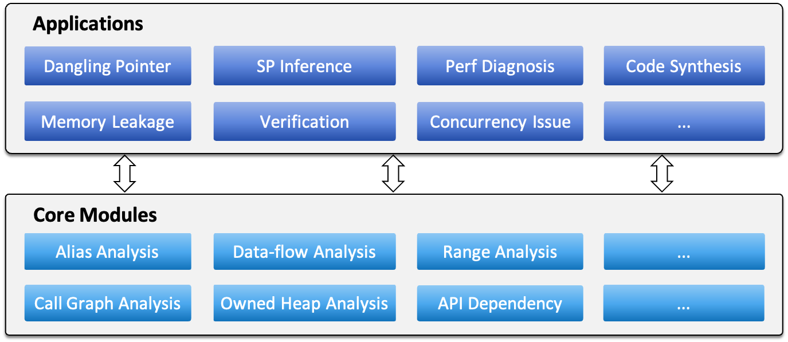

# Chapter 1. Introduction

RAPx is a static analysis platform for Rust programs with two objectives:

* To serve as a companion to the Rust compiler in detecting semantic bugs related to unsafe code.
* To provide ready-to-use program analysis features for tool developers.

Although Rust has made significant progress in ensuring memory safety and protecting software from undefined behavior, the Rust compiler's capability is inherently limited due to Rice's theorem. In general, it refrains from detecting undefined behaviors related to unsafe code, as achieving both precise and efficient analysis is extremely challenging. This limitation arises because the Rust compiler prioritizes usability, as developers cannot tolerate false positives. RAPx is not bound by this constraint. It may produce false positives, as long as they remain within an acceptable range.

Writing program analysis tools is challenging. In this project, we also aim to provide a user-friendly framework for developing new static program analysis features for Rust. In particular, our project integrates dozens of classic program analysis algorithms, including those for pointer analysis, value-flow analysis, control-flow analysis, and more. Developers can choose and combine them like Lego blocks to achieve new bug detection or verification capabilities.

The following figure demonstrates the framework of RAPx, which is composed of a core layer and an application layer. The project repository of RAPx can be found [here](https://github.com/Artisan-Lab/RAPx). Note that the project is still under heavy development, and some modules are not available yet.

