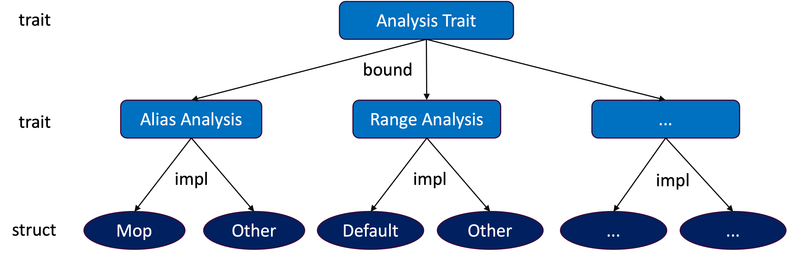

# Chapter 5. Core Modules

This chapter introduces the core modules of RAPx, which implements several commonly used program analysis features, including alias analysis, dataflow analysis, control-flow analysis, and more. Please refer to the corresponding sub-chapters for more information.

Since many static analysis tasks are inherently undecidable due to the limitations of Rice’s Theorem, the core module adopts a layered design that enable users to customize their own analysis routines.


As shown in the above figure, the top level defines an `Analysis` trait, and each analysis feature is implemented as a subtrait that is bounded by the Analysis trait. For each feature, RAPx provides a default implementation via a corresponding struct. Users can utilize a feature by creating an instance of the struct and invoking the `run` method defined in the `Analysis` trait.

```rust
pub trait Analysis {
    fn name(&self) -> &'static str;
    fn run(&mut self);
}

pub trait AnalysisFeature: Analysis {
    // APIs related to the AnalysisFeature
}

pub struct MyAnalysisFeature {
    // APIs of the struct
}

impl Analysis for MyAnalysisFeature { ... }
impl AnalysisFeature for MyAnalysisFeature { ... }
```
