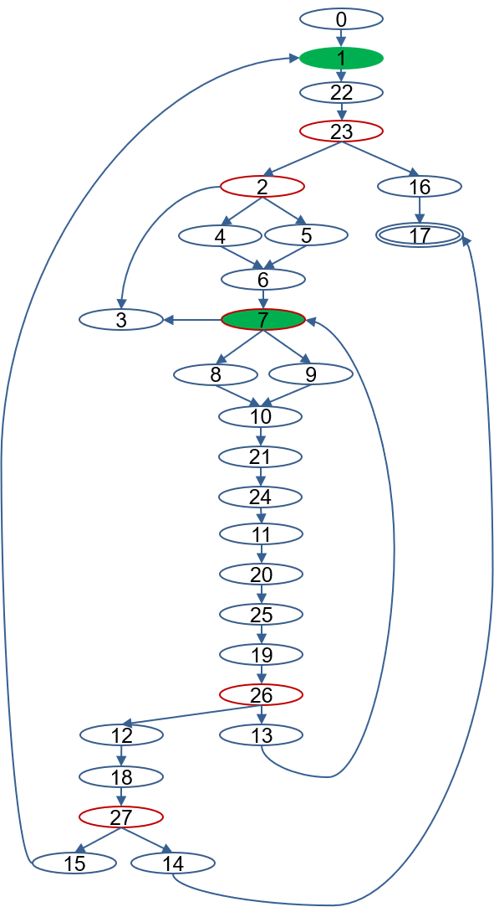
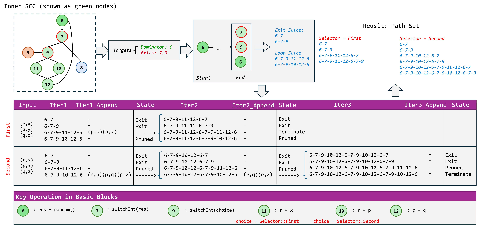

# Chapter 5.1. Alias Analysis
Alias analysis involves determining if two identifiers point to the same memory allocation. The task is challenging, with various options that balance precision and cost, including flow sensitivity, field sensitivity, and path sensitivity. In general, there are two main approaches to analysis: the lattice-based approach and the meet-over-all-paths (MOP) approach.

## 5.1.1 Alias Analysis Trait
RAPx provides the [`AliasAnalysis`](https://docs.rs/rapx/latest/rapx/analysis/core/alias_analysis/trait.AliasAnalysis.html) trait for alias analysis. The trait has several methods, which enables users to query the aliases among the arguments and return value of a function based on the function `DefId`, or the aliases of all functions as a `FxHashMap`. Developers can implement the trait based on their needs.
```rust
pub trait AliasAnalysis: Analysis {
    fn get_fn_alias(&self, def_id: DefId) -> Option<FnAliasPairs>;
    fn get_all_fn_alias(&self) -> FnAliasMap;
    fn get_local_fn_alias(&self) -> FnAliasMap;
}
```

The alias analysis result for each function is stored as the `FnAliasPairs` type, which contains a `HashSet` of multiple alias relationships, and each alias relationship is recorded as `AliasPair`.
```rust
pub struct FnAliasPairs {
    arg_size: usize,
    alias_set: HashSet<AliasPair>,
}
pub struct AliasPair {
    pub left_local: usize, // parameter id; the id of return value is `0`;
    pub lhs_fields: Vec<usize>, // field-sensive: sequence of (sub) field numbers for left_local
    pub right_local: usize, // parameter id, which is an alias of left_local
    pub rhs_fields: Vec<usize>, // field-sensive: sequence of (sub) field numbers for right_local
}
```

RAPx has implemented a default alias analysis algorithm based on MOP.

## 5.1.2 Default Alias Analysis
The MOP-based alias approach is achieved via a struct `AliasAnalyzer`, which implements the `AliasAnalysis` trait. The detailed implementation can be found in [mop.rs](https://github.com/Artisan-Lab/RAPx/blob/main/rapx/src/analysis/core/alias/mop.rs). 
```rust
pub struct AliasAnalyzer<'tcx> {
    pub tcx: TyCtxt<'tcx>,
    pub fn_map: FxHashMap<DefId, MopFnAliasPairs>,
}
```
The results can be retrieved by decoding the data structure of `FnAliasPairs `.

Suposing the task is to analyze the alias relationship among the return values and the arguments, the approach performs alias analysis for each execution path of a target function and merges the results from different paths into a final result. When encountering function calls, it recursively analyzes the callees until all dependencies are resolved. This approach is path-sensitive and field-sensitive but context-insensitive.

### 5.1.2.1 Feature: Path Sensitive with Light Reachability Constraints
In the following code, there are two conditional branches. If adopting a lattice-based approach, `a` could be an alias of either `x` or `y` at program point ①. Consequently, the return value could also be an alias of either `x` or `y`.
However, this analysis is inaccurate, and `a` cannot be an alias of `y` in this program.
In fact, the function `foo` has four execution paths induced by the two conditional branches. Among them, only one path involves an alias relationship between the return value and `y`. This path requires `choice` to be `Selector::Second` in the first conditional statement and `Selector::First` in the second conditional statement, which is impossible. Therefore, this path is unreachable, and `a` should not be considered an alias of `y` in this program.


```rust
enum Selector {
    First,
    Second,
}

fn foo<'a>(x: &'a i32, y: &'a i32, choice: Selector) -> &'a i32 {
    let a = match choice {
        Selector::First => x, 
        Selector::Second => y,
    };
    // program point ①.
    match choice {
        Selector::First => a, 
        Selector::Second => x,
    }
}
```

Our MOP-based approach can address this issue by explicitly extracting each execution path and justifying its reachability through the maintenance of a set of constant constraints.
We use the following MIR code for illustration, which corresponds to the previous source code. In `bb0`, there is a `SwitchInt()` instruction that branches control flow to `bb3` if `_5` is `0`, to `bb1` if `_5` is `1`, or to `bb2` otherwise.
Accordingly, we impose constant constraints on `_5` along each branch: in `bb3`, `_5` is constrained to be `0`; in `bb1`, `_5` is constrained to be `1`; and in `bb2`, `_5` is constrained to be neither `0` nor `1`. With these constraints in place, when execution reaches the second conditional statement in `bb4`, the analysis can rule out two unreachable combinations of branch conditions.

```rust
fn foo(_1: &i32, _2: &i32, _3: Selector) -> &i32 {
    bb0: {
        StorageLive(_4);
        _5 = discriminant(_3);
        switchInt(move _5) -> [0: bb3, 1: bb1, otherwise: bb2];
    }

    bb1: {
        _4 = _2;
        goto -> bb4;
    }

    bb2: {
        unreachable;
    }

    bb3: {
        _4 = _1;
        goto -> bb4;
    }

    bb4: {
        _6 = discriminant(_3);
        switchInt(move _6) -> [0: bb6, 1: bb5, otherwise: bb2];
    }

    bb5: {
        _0 = _1;
        goto -> bb7;
    }

    bb6: {
        _0 = _4;
        goto -> bb7;
    }

    bb7: {
        StorageDead(_4);
        return;
    }
}
```

### 5.1.2.2 SCC Handling (default)
A major challenge for path-sensitive analysis lies in the presence of strongly connected components (SCCs), since loops may induce an unbounded number of execution paths. We address this challenge based on the following two observations:

- Each SCC in MIR has a dominator, i.e., every loop in MIR is a *natural loop*. This property allows us to construct SCC trees that capture the hierarchical structure of loops.
- Traversing the same loop path once or multiple times does not change the resulting alias relationships.

Based on these observations, we can soundly bound path exploration by collapsing repetitive loop traversals. In the following, we use a concrete example to demonstrate how these findings enable efficient and precise path enumeration in the presence of loops.
```rust
enum Selector {
    First,
    Second,
}

// Expected alias analysis result: (0, 1) (0, 2)
fn foo(x: *mut i32, y: *mut i32, choice: Selector) -> *mut i32 {
    let mut r = x;
    let mut q = x;

    unsafe {
        while *r > 0 {
            let mut p = match choice {
                Selector::First => y,
                Selector::Second => x,
            };

            loop {
                r = q;
                q = match choice {
                    Selector::First => x,
                    Selector::Second => p,
                };
                *q -= 1;
                if *r <= 1 {
                    break;
                }
                q = y;
            }

            if *r == 0 {
                break;
            }
        }
    }

    r
}
```

The following figure illustrates the control-flow graph of the code. 


There is a large SCC  
`{1, 22, 23, 2, 4, 5, 6, 7, 8, 9, 10, 21, 24, 11, 20, 25, 19, 26, 13, 12, 18, 27, 15}`,  
whose dominator is node `1`, since every path from the entry node to any node in this SCC must pass through `1`.

Next, we identify sub-SCCs by removing the dominator of the SCC. Starting from node `22`, which is a successor of the removed dominator `1`, we discover a sub-SCC  
`{7, 8, 9, 10, 21, 24, 11, 20, 25, 19, 26, 13}`,  
with dominator `7`.

These two dominators form a hierarchical relationship. In practice, an SCC may contain multiple sub-SCCs, and sub-SCCs may themselves contain further nested SCCs. This naturally yields a tree structure that represents multi-level SCC nesting.

In this way, we enumerate valuable paths of an SCC tree in a recursive manner. We define a path as a sequence from the dominator to an exit of the corresponding sub-SCC. For example, `7-8-10-21-24-11-20-25-19-26` is such a path.

A node sequence is worth further exploration only if the most recent traversal between two occurrences of the same dominator introduces at least one previously unvisited node. For instance,  
`7-8-10-21-24-11-20-25-19-13-7-8-10-21-24-11-20-25-19-13-7` is not worth exploring, since the second segment is a duplication of the first and does not introduce any new nodes.

In contrast, `7-8-10-21-24-11-20-25-19-13-7-9-10-21-24-11-20-25-19-13-7` is worth exploring because the second segment introduces a new node `9`, which may lead to new alias relationships. The resulting path is  
`7-8-10-21-24-11-20-25-19-13-7-9-10-21-24-11-20-25-19-13-7-8-10-21-24-11-20-25-19-26`.

Using this strategy, our approach generates the following 10 paths for the inner SCC.

- `7-8-10-21-24-11-20-25-19-26`
- `7-9-10-21-24-11-20-25-19-26`
- `7-8-10-21-24-11-20-25-19-13-7-8-10-21-24-11-20-25-19-26`
- `7-8-10-21-24-11-20-25-19-13-7-9-10-21-24-11-20-25-19-26`
- `7-9-10-21-24-11-20-25-19-13-7-8-10-21-24-11-20-25-19-26`
- `7-9-10-21-24-11-20-25-19-13-7-9-10-21-24-11-20-25-19-26`
- `7-8-10-21-24-11-20-25-19-13-7-9-10-21-24-11-20-25-19-13-7-8-10-21-24-11-20-25-19-26`
- `7-8-10-21-24-11-20-25-19-13-7-9-10-21-24-11-20-25-19-13-7-9-10-21-24-11-20-25-19-26`
- `7-9-10-21-24-11-20-25-19-13-7-8-10-21-24-11-20-25-19-13-7-8-10-21-24-11-20-25-19-26`
- `7-9-10-21-24-11-20-25-19-13-7-8-10-21-24-11-20-25-19-13-7-9-10-21-24-11-20-25-19-26`

Note that this path enumeration strategy can effectively detect the alias relationship between `r` and `y`, for example via the path `7-9-10-21-24-11-20-25-19-13-7-9-10-21-24-11-20-25-19-26`.  
In contrast, a straightforward DFS-based traversal fails to detect this alias relationship.

Our analysis adopts a recursive strategy instead of an iterative bottom-up approach. A purely bottom-up method, although potentially more efficient, ignores path constraints introduced outside an SCC and may therefore over-approximate reachable paths. To address this limitation, our analysis starts from the outermost SCC and proceeds inward. When the analysis reaches an inner SCC, it propagates the accumulated path constraints from the outer context and uses them to determine which of the 10 inner-SCC paths are reachable. For each reachable path, the analysis then concatenates the corresponding inner-SCC subsequence with the path of the outer SCC, continuing the exploration.


### 5.1.2.3 SCC Handling with Fix-Point (Experimental)

#### Motivating Case

The motivating example below illustrates a representative pattern of **Loop-Carried State Propagation**, featuring nested loops guarded by correlated constraints. The function includes an immutable configuration variable, `choice`, which synchronizes the behavior of an outer loop (initializing pointer `p`) and an inner loop (using `p` to assign `r`).


```rust
// Expected result: (r,x) (r,z)
fn test_pipeline_correlation<'a>(x: &'a i32, y: &'a i32, z: &'a i32, choice: Selector) -> &'a i32 {
    let mut r = x; 
    let mut q = z; 

    // [Outer SCC]: Configuration Phase
    loop {
        // Defines the 'Source' of the pipeline based on 'choice'
        // This is the "Input Valve"
        let mut p = match choice {
            Selector::First => y,   // Path A: Source is 'y' 
            Selector::Second => x,  // Path B: Source is 'x'
        };

        // [Inner SCC]: Propagation Phase (The Pipeline)
        loop {
            if random() { break; }
            r = match choice {
                Selector::First => x,      
                Selector::Second => p, 
            };
            p = q;
        }
        if random() { break; }
    }
    r
}
```

* **Path A (`Selector::First`):** The outer loop initializes `p` to alias `y`. However, the inner loop explicitly assigns `r` to `x`, structurally guarding `y` from reaching `r`.

* **Path B (`Selector::Second`):** The outer loop initializes `p` to alias `x`. A critical mutation  (where `q` points to `z`) occurs at the end of the inner loop. In the first iteration, `r` is assigned `x`, but in subsequent iterations, the back-edge propagates the mutated `p`, causing `r` to alias `z`.


The core challenge is that `r` must strictly alias `{x, z}`. Traditional methods fail here: state merging (MFP) conflates the contexts of `First` and `Second`, falsely suggesting `r` aliases `y`. Conversely, linearization methods (spanning trees) sever the back-edge, failing to capture the loop-carried dependency where `p` transitions to `z`.


#### Method Overview

**Slice-Splicing Path Generation**
Inside an SCC, the solver abandons rigid unrolling in favor of a **Slice-Splicing** strategy. It first decomposes the loop into fundamental behavioral units called **Base Slices**, which include **Exit Slices** (terminating the loop) and **Loop Slices** (completing a single iteration). The solver then dynamically synthesizes full execution traces by recursively splicing these loop slices onto the current path, simulating the loop's execution behavior.

**Discrete Constraint Propagation (DCP)**
To ensure semantic feasibility, the framework integrates a lightweight **Discrete Constraint Propagation** engine that operates in lockstep with topological traversal. By projecting high-level constructs (enums, booleans) into a unified integer constraint space via **Unified Discrete Projection** , the solver treats control-flow edges as assertion generators. A **Snapshot-Backtracking** mechanism manages the constraint context, allowing the solver to speculatively bind variables and prune logically unreachable paths with  complexity upon detecting conflicts.

**State-Stability Guided Termination**
The recursion depth of loop unrolling is governed by dual validity checks: **Logical Consistency** and **State Stability**. The enumeration continues only if the spliced path is logically satisfiable and induces a substantive change in the abstract state. Once a local fixpoint is reached or an exit slice is appended, the resulting valid internal traces are integrated back into the global path via a **Backfilling Operation**, propagating precise context-sensitive states to the subsequent control flow.


#### Case Study
The figure below illustrates how the framework achieves path-sensitive analysis within the cyclic structure of the Motivating Example. The central challenge lies in simultaneously maintaining path constraints while computing a fixpoint for the loop. Leveraging our **top-down** analysis strategy, the solver inherits constraint information from the predecessor path upon entering the inner SCC. Specifically, the immutable predicate `choice` is already resolved to either `First` or `Second` within the current context, guiding the subsequent path generation.



**Constraint-Guided Path Generation.**
In the context where `choice` is determined to be **`First`**, the solver enforces strict constraint validation. Since traversing Node 10 requires the conflicting condition `selector=Second`, all paths attempting to pass through Node 10 are immediately pruned.

* **Iteration 1:** The path traverses Node 12, introducing a new alias relationship `p=q`. Consequently, the trace (6-7-9-11-12) is extended into the second iteration.
* **Iteration 2:** Base paths are spliced onto the current trace. Similarly, branches leading to Node 10 are pruned due to the mutual exclusivity of path constraints.
* **Convergence:** A fixpoint is reached in the second round. All traces with states marked as `exit` are collected, resulting in a set of **4 valid internal traces** ready for external integration.

A similar logic applies to the context where `choice` is **`Second`**, with a key distinction in state evolution.

* **State Propagation:** This execution flow traverses the assignments `r=p` and `p=q`.
* **Convergence:** During the second iteration, the alias relationship is updated to `r=p=z` (capturing the loop-carried dependency). Consequently, the analysis requires a **third iteration** to reach a stable fixpoint. This process ultimately yields a set of **6 valid internal traces**.

**Global Integration via Backfilling.**
Upon completing the inner SCC analysis, the global analyzer executes a **Backfilling Operation**. These result paths are physically grafted onto the end of the paused external path. By carrying the precisely computed context state, this mechanism allows for the seamless resumption of global traversal from the outer successor nodes (*e.g.*, Nodes 8 and 3), ensuring that the complex internal behavior of the loop is accurately reflected in the downstream analysis.


### 5.1.2.4 Feature: Field Sensitive 

In the following example, the return value of `foo()` is an alias of the first field of its first argument.
```rust
struct Point {
    x: i32,
    y: i32,
}

fn foo(p1: &Point) -> &i32 {
    &p1.y
}
```

The corresponding MIR code is as follows:

```rust
fn foo(_1: &Point) -> &i32 {
   bb0: {
        _0 = &((*_1).1: i32);
        return;
    }
}
```

The alias analysis result should be (0, 1.1).

 
### 5.1.3 Quick Usage Guide

Developers can test the feature using the following command:
```
cargo rapx -alias
```

For example, we can apply the mop analysis to the first case, and the result is as follows:
```shell
Checking alias_mop_field...
21:50:18|RAP|INFO|: Start analysis with RAP.
21:50:18|RAP|INFO|: Alias found in Some("::boxed::{impl#0}::new"): {(0.0,1)}
21:50:18|RAP|INFO|: Alias found in Some("::foo"): {(0,1.1),(0,1.0)}
```

When applying the mop analysis to the first case, and the result is as follows:

```shell
Checking alias_mop_switch...
21:53:37|RAP|INFO|: Start analysis with RAP.
21:53:37|RAP|INFO|: Alias found in Some("::foo"): {(0,2),(0,1)}
21:53:37|RAP|INFO|: Alias found in Some("::boxed::{impl#0}::new"): {(0.0,1)}
```

To utilize the analysis results in other analytical features, developers can refer the following example:

```rust
let mut alias_analysis = AliasAnalyzer::new(self.tcx);
alias_analysis.run();
let result = alias_analysis.get_local_fn_alias();
rap_info!("{}", AAResultMapWrapper(result));
```

The code above performs alias analysis for each function, recording the alias pairs between two arguments or between an argument and the return value. 

### Key Steps of Our Algorithm
There are three key steps ([source code](https://github.com/Artisan-Lab/RAP/blob/f76b764cb5b66ccfddd19dc083586b7a6a90b576/rap/src/analysis/core/alias/mop.rs#L57C13-L59C50)):
```rust
let mut mop_graph = MopGraph::new(self.tcx, def_id);
mop_graph.solve_scc();
mop_graph.check(0, &mut self.fn_map);
```

* **Graph preparation**: Construct the control-flow graph for the target function. See the [source code](https://github.com/Artisan-Lab/RAPx/blob/4ead41498bc24c77e84502e8da0bac87d1bcc5f4/rapx/src/analysis/core/alias_analysis/default/graph.rs#L135C1-L135C4).
* **SCC shrinkage**: Extract the strongly connected components (SCCs) and shrink SCCs of the control-flow graph. See the [source code](https://github.com/Artisan-Lab/RAPx/blob/4ead41498bc24c77e84502e8da0bac87d1bcc5f4/rapx/src/analysis/core/alias_analysis/default/graph.rs#L463).
* **Alias Check**: Traversal the control-flow graph and perform alias analysis. See the [source code](https://github.com/Artisan-Lab/RAPx/blob/4ead41498bc24c77e84502e8da0bac87d1bcc5f4/rapx/src/analysis/core/alias_analysis/default/mop.rs#L56)

### Reference
The feature is based on our SafeDrop paper, which was published in TOSEM.  
```
@article{cui2023safedrop,
  title={SafeDrop: Detecting memory deallocation bugs of rust programs via static data-flow analysis},
  author={Mohan Cui, Chengjun Chen, Hui Xu, and Yangfan Zhou},
  journal={ACM Transactions on Software Engineering and Methodology},
  volume={32},
  number={4},
  pages={1--21},
  year={2023},
  publisher={ACM New York, NY, USA}
}
