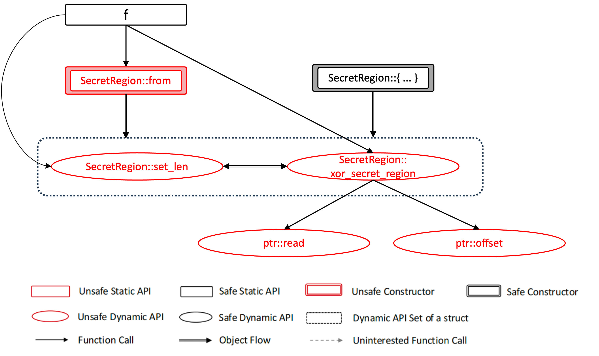
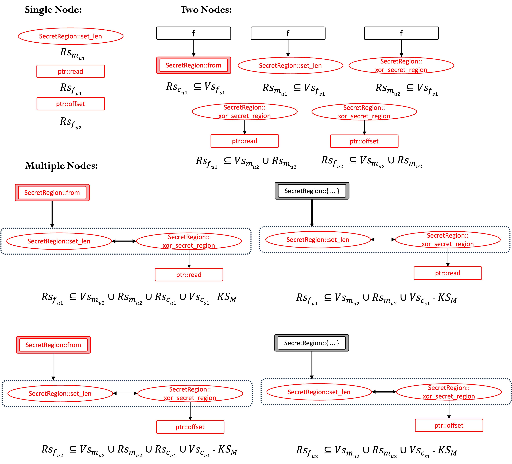
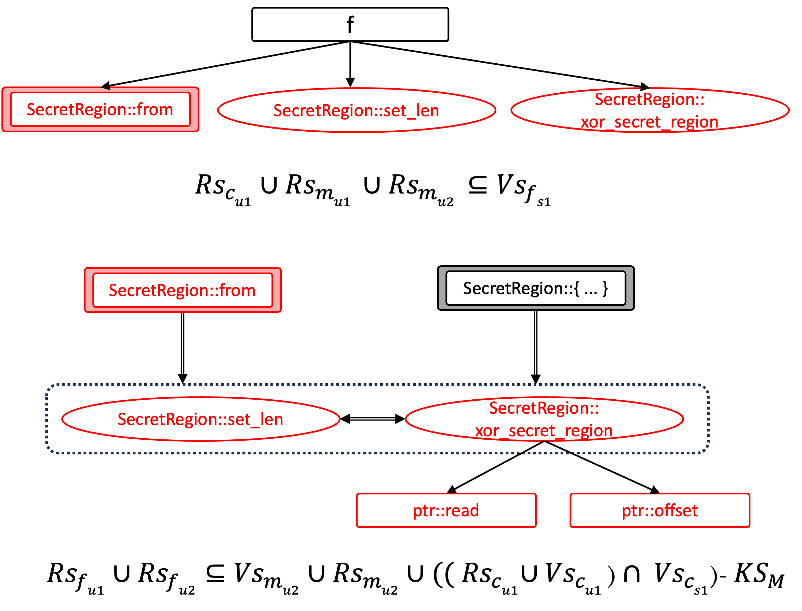
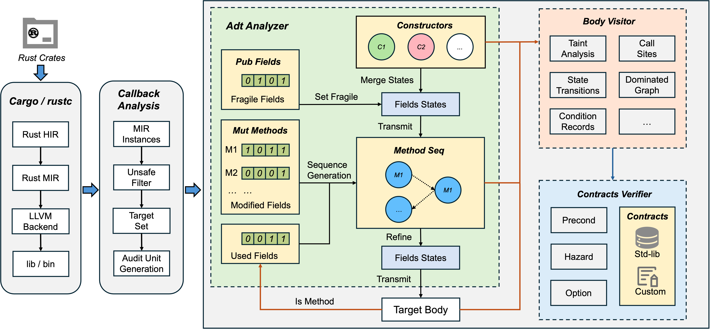
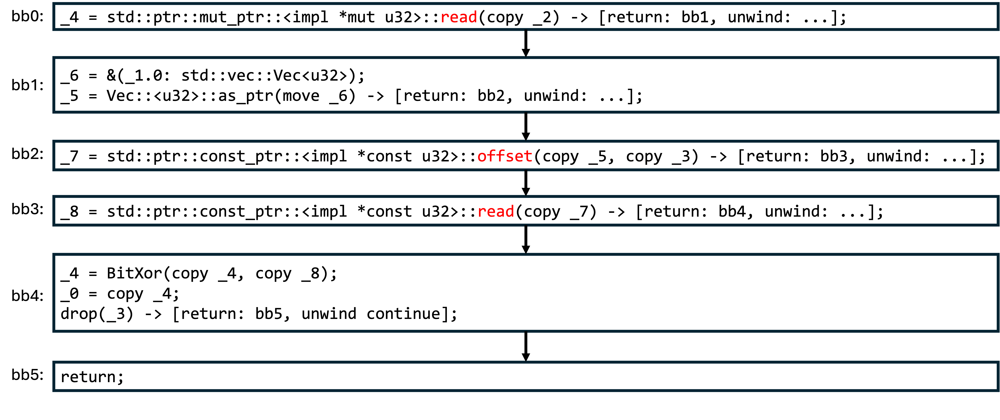
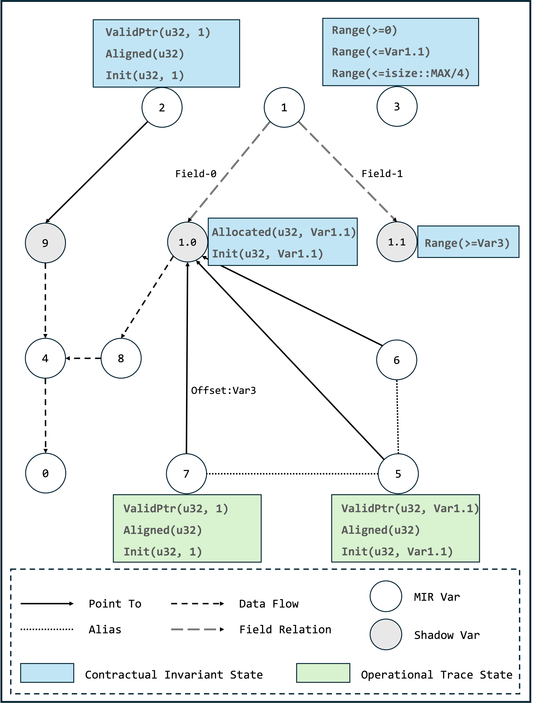

# Chapter 6.4. Unsafe Code Audit and Verification
## 1 Overview
Unsafe Code enables necessary low-level operations, but it bypasses Rust's compiler guarantees, potentially introducing ​​undefined behavior (UB)​​ if used incorrectly. 

This module employs call graph segmentation and dataflow analysis for systematic code auditing, and utilizes abstract interpretation and contract-based verification to check safety properties. Specifically, it operates on three core pillars:

(1) Audit unit generation: Segmenting Rust code into independent units to set analysis boundaries for verification and inference.

(2) Safety property verification: Verifying if the safety properties required by unsafe APIs are satisfied.

(3) Safety property inference: Inferring the safety properties of unsafe APIs based on the audit unit.

### Core Assumptions
Our approach rests on two foundational assumptions:
* **P1:** All undefined behavior originates from unsafe code blocks
* **P2:** A function is sound if all execution paths satisfy safety properties of unsafe operations they interact with.

## 2 Audit Unit Generation
### 2.1 What's the Audit Unit
Audit unit is the foundational abstraction which defines analysis boundaries for verification and inference.

### 2.2 Why Audit Unit Is Needed
Just as our assumption **P1** states, undefined behavior (UB) only originates from unsafe code blocks. Therefore, the detection of UB essentially involves the management of unsafe code.

Given a Rust crate, there are three typical scenarios to be considered for unsafe code handling: 

* Original unsafe code annotation: (i) Unsafe code in a Rust crate without any other internal unsafe code; (ii) An unsafe API originating from another library outside the crate.

* Safe property delegation: An unsafe API which exposes the safety requirements of internal unsafe code.

* Safety encapsulation: A safe API which fully enforces all necessary safety properties of internal unsafe code.

These scenarios inherently have boundaries, where the unsafety propagation can be contained or observed. Therefore, to effectively isolate, analyze, and verify the safety of unsafe code, we establish audit units to enable focused and manageable safety audits.

### 2.3 How to Construct and Use Audit Unit

#### 2.3.1 Audit Unit Construction
The audit unit combines the traditional call graph with unsafe and dataflow information to capture the use and propagation of unsafe code across the project. It is constructed as follows:

(1) Identify all functions and methods with unsafe markers. Add call and object-flow edges to form unsafety propagation graphs (UPG).

(2) Divide UPG according to the structural patterns of basic units (More detailed information can be obtained from [our paper](https://arxiv.org/abs/2504.21312)).

(3) Merge basic units when multiple unsafe callees share a common caller or when a dynamic-method caller has multiple constructors to construct audit units.

#### 2.3.2 Audit Unit Usage
The **audit unit** constitutes the foundational abstraction, defining analysis boundaries for verification and inference. It integrates with the [tag-std](https://github.com/Artisan-Lab/tag-std/blob/main/primitive-sp.md) - a comprehensive taxonomy of safety properties extracted from Rust's standard library - to establish a unified analytical foundation.

**Usage Summary**: Audit Unit → Set analysis scope → tag-std (safety rules) → Contracts verified or UB detected.

#### 2.3.3 Poc of Audit Unit
Here is a simple structure along with its corresponding constructor and methods.

```rust
/// Record secret buffer with its size.
struct SecretRegion {
    buffer: Vec<u32>,
    len: usize,
}

impl SecretRegion {
    pub unsafe fn from(v: Vec<u32>, l: usize) -> Self {
        SecretRegion { buffer: v, len: l }
    }
    
    pub unsafe fn set_len(&mut self, l:usize) {
        self.len = l;
    }
    
    pub unsafe fn xor_secret_region(
        &self,
        ptr: *mut u32,
        offset: isize,
    ) -> u32 {
        let mut src_value = ptr.read();
        let secret_ptr = self.buffer.as_ptr();
        let secret_region_ptr = secret_ptr.offset(offset);
        let secret_value = secret_region_ptr.read();
        src_value ^= secret_value;
        src_value
    }
}

fn f() {
    let mut v = vec![0xDEADBEEF, 0xCAFEBABE, 0x12345678];
    let mut data = [0x11111111, 0x22222222, 0x33333333];
    let (p,l,_c) = v.into_raw_parts();
    let mut s = unsafe { SecretRegion::from(p, 0)};
    unsafe { 
        s.set_len(l);
        s.xor_secret_region(data.as_mut_ptr(), 0);
    }
}
```

Figure 1a-1c shows the specific generation process of the audit units for the code. Here, we use **required safety property (RS)** and **verified safety property (VS)** to construct an audit formula to describe the satisfaction conditions of each audit unit. **RS** and **VS** are sets of safety tags from tag-std.



**Fig-1a**: Unsafety propagation graph. Function calls like `f -> Vec::into_raw_parts` are not considered in the UPG because they are all safe functions and do not involve any safety considerations.


**Fig-1b**: Basic units generated by splitting Fig-1a. Each basic unit involves a non-trivial safety requirement that should be audited, and it cannot be further simplified.


**Fig-1c**: Audit units generated by merging Fig-1b. Each audit unit has its corresponding audit formula.

## 3 Safety Property Verification
**Senryx** is the module within RAPx responsible for verifying safety properties. Building upon abstract interpretation, **Senryx** employs a **contract-based verification approach** to verify whether the audit formulas in the audit unit are satisfied. It operates as follows:

(1) **Compiler-Integrated Target Identification**: 

RAPx leverages Rust's compiler callback to identify MIR instances and filter unsafe code segments as target set. Corresponding ​​audit unit will be generated for each target, which serves as the basic verification entity for **Senryx**.

(2) **Stateful Field Analysis**

**Senryx** performs data-flow and state tracking on MIR bodies. If the audit unit is of a ​​multiple-node​​ type, meaning the target is a method, the ​​ADT analyzer​​ will be loaded. The method's constructors and other mutable methods will be evaluated for field modification patterns.

* **Fragile Fields**: The public fields within a structure are considered fragile because they can be accessed and modified from outside constructors. We are still exploring and evaluating the impact of fragile fields on safety properties.

* **Modified Fields**: Modified fields will generate the method sequence, which is used to determine all possible pre-target states. This analysis is necessary because it accounts for side effects. For example, `St2::set_len` will make `St2::get` get into a hazard state in Section 2.

(3) **Control-Flow Modeling**

`Body visitor` employs MOP to capture state transitions and construct dominated graphs (see Section 3.2 for more details).

(4) **Contract-Based Safety Verification**

Contract verifier will be applied to check whether all the safety properties of the unsafe callees are fully satisfied (see Section 3.1 for more details).




### 3.1 Contract Construction
**Senryx** establishes a rigorous verification system using annotated safety contracts for Rust's standard library. 

We maintain an annotated fork of Rust standard library where every unsafe API is tagged with its required safety properties using tag-std format. For example:
```rust
#[rapx::inner(property = InBounded (self, T, count), kind = "precond")]
#[rapx::inner(property = ValidNum (count * size_of(T) <= isize::MAX), kind = "precond")]
pub const unsafe fn offset(self, count: isize) -> *const T
```
#### Usage 
```
cd /to-be-verified-crate/

export RUSTUP_TOOLCHAIN=nightly-2025-06-02
export __CARGO_TESTS_ONLY_SRC_ROOT=/path-to-pre-annotated-std-lib/library

// In Linux
cargo +nightly-2025-06-02 rapx -verify -- -Zbuild-std=panic_abort,core,std --target x86_64-unknown-linux-gnu
// In Mac(Arm)
cargo +nightly-2025-06-02 rapx -verify -- -Zbuild-std=panic_abort,core,std --target aarch64-apple-darwin
```

### 3.2 Program State Modeling via Dominated Graphs
Senryx​​ verifies safety properties through sophisticated state modeling at Rust's MIR level.
The core approach tracks variable states along execution paths using a ​​**Dominated Graph (DG)​​** data structure that captures two complementary state perspectives:

(1) All annotations preceding the unsafe code will construct the **Contractual Invariant States (CIS)** of the arguments; 

(2) The static analyzer analyzes step by step along the MIR path and infers the **Operational Trace States (OTS)** based on the semantics. 

To demonstrate how ​​Senryx​​ tracks program states and verifies safety contracts, we'll use the `xor_secret_region` method from Section 2 as our running example. 

#### 3.2.1 Safety Contract Declaration​ for Unsafe Target
In our verification process:

* Safe functions undergo direct verification to ensure they properly encapsulate unsafe operations

* Unsafe functions first require annotations of their safety requirements. These annotations will be used as fundamental invariants to verify internal unsafe callees' requirements.

For our target method `xor_secret_region` as example, since it is an unsafe method, we pre-examine its function body and declare:

```rust
// ValidPtr (ptr, u32, 1)
// Aligned (ptr, u32)
// Init (ptr, u32, 1)
// ValidNum (offset >= 0)
// ValidNum (self.size >= offset)
// ValidNum (offset * 4 <= isize::MAX)
// Allocated (self.buffer, u32, self.size)
// Init (region.buffer, u32, region.size)
pub unsafe fn xor_secret_region(
    &self,
    ptr: *mut u32,
    offset: isize,
) -> u32 {
    let mut src_value = ptr.read();
    let secret_ptr = self.buffer.as_ptr();
    let secret_region_ptr = secret_ptr.offset(offset);
    let secret_value = secret_region_ptr.read();
    src_value ^= secret_value;
    src_value
}
```
#### 3.2.2 CIS Construction
Pre-defined annotations translate directly into ​​CIS and serve as the foundation for subsequent state tracking.

To support more granular state binding, we introduce specialized ​​shadow variables​​ to represent:

* ​​**Pointer Memory**: For pointer variables, we create shadow variables to track the state of the memory they reference (e.g., ​​Var9 in the figure below​​, it has been re-encoded).
* ​​**Field-Sensitive​​**: For structure fields, we extend to field-level granularity (e.g., ​​Var1.0​​, ​​Var1.1​​ in the figure below​​) to capture fine-grained state transitions.

#### 3.2.3 OTS Construction
Subsequently, **Senryx** will perform state assignment for the variables based on the statements of MIR:

Take `_5 = Vec::<u32>::as_ptr(move _6) ` as example, the original memory (**Var1.0** pointed by **Var6**) has the `Allocated` and `Init` states, the generated alias pointer **Var5** also inherits this state and has the `ValidPtr` semantic.

After all the statements on the path have been checked, we will obtain the final dominated graph. The process can be summarized as follows:

+ Input parameters are analyzed first: any pointer or reference (like read in dg1) triggers the creation of a dedicated shadow variable node (e.g., ValidPtr(u32, 1) in dg2) to represent its memory properties. Composite types are decomposed so that each field gets a dedicated node (e.g., Var1.0, Var1.1 for struct fields). 

+ Using abstract interpretation, we analyze MIR statements to infer relationships and constraints. Pointer operations (like dereferences or offsets) will all be recorded in detail. For example, when a pointer arithmetic call (`ptr::offset`) occurs, a new derived variable (Var7) is generated from the base pointer (Var5) with an explicit offset (Var3). The `offset: Var3` indicates that it will be offset by `Var3 * sizeof(u32)` bytes from the object's base address.

+ Data dependencies are established for value transfers and operations. For example, the `_4 = BitXor(_4, _8)` will create dataflow between Var4 and Var8.



#### 3.2.4 Safety Contract Checking​
Whenever an unsafe call site is encountered, this step will be executed to detect the target contracts. In this case, we should verify the contracts of `ptr::read` and `ptr::offset`.

The verification engine validates safety contracts through state unification between OTS and CIS. For example, consider the `ptr::offset`'s callsite and signature:
```rust
// callsite:
_7 = std::ptr::const_ptr::<impl *const u32>::offset(copy _5, copy _3) 

// signature:
pub const unsafe fn offset(self, count: isize) -> *const T

// transition of arguments names to MIR variables
self => Var5
count => Var3
```

Subsequently, we verify `ptr::offset`'s two contracts based on the states of Var5 and Var3.

(1) InBounded (self, u32, count) => **InBounded (Var5, u32, Var3)**

* Var5 has OTS: `ValidPtr(u32, var1.1)`. `ValidPtr` is a composite SP, which implies `InBounded(u32, var1.1)`.
```
   Var5: ValidPtr(u32, var1.1)
=> Var5: InBounded(u32, var1.1)
=> Var5: InBounded(u32, var1.1) + Var1.1 >= Var3
=> InBounded (Var5, u32, Var3)
=> Pass!
```

(2) ValidNum (count * size_of(T) <= isize::MAX) => **ValidNum (Var3 * size_of(u32) <= isize::MAX)**

* Var3 has the CIS: `Range(<=isize::MAX/4)`.
```
   Var3 <=isize::MAX/4 
=> Var3 * size_of(u32) <= isize::MAX 
=> ValidNum (Var3 * size_of(u32) <= isize::MAX)
=> Pass!
```

### 3.3 Vulnerable Path Analysis
Before reaching the unsafe call site, we need to track the variable states of its arguments. They may be affected by other variables along the path. We refer to such paths as **vulnerable paths**.

If the analysis target is a method taking `self` as an argument, its vulnerable path comprises two components:
* Inter-procedural paths combining constructors and mutable methods. This can be referred to in the **_Adt Analyzer_** section of the above architecture diagram. The algorithm for generating mutable method sequence is still under development.
* Intra-procedural paths from the function's entry point(s) to unsafe call sites within the method body.

If the analysis target is a function without a `self` parameter, only the latter is considered.


## 4 Safety Property Inference
### 4.1 audit unsafe APIs' SP in `core` and `alloc`
Specifically, we currently integrate a set of SP labels analysis for `core` and `alloc` crate of the Rust standard library.
1. Create a new `helloworld` project.
2. Navigate to the `helloworld` project directory and run:
```
cargo rapx -stdsp -- -Zbuild-std --target x86_64-unknown-linux-gnu > /your/output/log/path/result.log 2>&1
```
Replace /your/output/log/path with your desired output directory. This will output APIs where the caller and callee have different SPs.


## 5 Soundness and Precision
RAPx provides sound detection of undefined behavior - if any path in the program contains UB, it will be reported. This guarantee comes with inherent over-approximation of program paths, which may yield false positives where reported UB paths are infeasible in concrete execution.

### 5.1 Granular Safety Property Detection Approach
RAPx operates at the abstraction level of Safety Properties (SPs) - fundamental invariants that must hold to prevent undefined behavior - rather than analyzing UB manifestations directly. This approach provides:

+ Condition Focus: SPs represent necessary conditions for UB (e.g., valid alignment before dereference)

+ Pattern-Specific Analysis: Detect defect patterns for per SP rather than symptomatic UB types

Currently, we've completed defect pattern research for some tag-std SPs. Using `Align` SP as our demonstration case, we'll explain how RAPx achieves soundness at the MIR level.

### 5.2 Demonstration Framework: Align SP in MIR
**Analysis Foundation**: 

+ The MIR statement types are finite and well-defined

+ Pointer misalignment originates from a limited set of operations

These characteristics enable comprehensive modeling of all defect patterns in MIR. Specifically, scenarios causing pointer misalignment are enumerable and fall into three categories:

+ Casting: Intrinsic operations changing pointer types

+ Pointer Arithmetic: Pointer arithmetic altering address alignment

+ Untrusted origins: Untrusted origins without alignment validation

These three mechanisms represent fundamental sources of misalignment. We systematically address each root cause through dedicated rules in sections 5.2.1-5.2.3. Additionally, we model secondary propagation scenarios where unaligned pointers contaminate other pointers through copies or derived operations. These propagation pathways are analyzed in section 5.2.4.

We will examine each category through concrete examples and formal rules. All the rules operate on following `Align` lattice:

```
L = {Top, Aligned, Unaligned, Unknown}
```
It has partial ordering:
```
        Top
      /     \
  Aligned  Unaligned
      \     /
      Unknown
```

`Alignment = 2^k (k ∈ ℕ)` represents concrete alignment values as powers of two.

#### 5.2.1 Casting
Type conversion operations are the main source of memory alignment issues. In Rust, when a pointer is forcibly converted from a low-alignment type to a high-alignment type, if the original address does not meet the alignment requirements of the new type, undefined behavior will occur. The following example demonstrates this dangerous conversion:
```rust
fn type_cast_ub() {
    let data = [0u8; 5]; // u8 => one byte alignment
    let ptr = data.as_ptr();
    let unaligned_ptr = ptr as *const u32;
    unsafe {
        // 💥 UB here! Ptr is not 4-byte aligned
        let _value = *unaligned_ptr; 
    }
}

Simple MIR of type_cast_ub:
bb 0 {
    Assign((_1, [const 0_u8; 5]))
    Assign((_4, &_1))
    Assign((_3, move _4 as &[u8] (PointerCoercion(Unsize, Implicit))))
    _2 = core::slice::<impl [u8]>::as_ptr(move _3) -> [return: bb1, unwind continue]
}
bb 1 {
    Assign((_6, copy _2))
    Assign((_5, move _6 as *const u32 (PtrToPtr)))
    Assign((_7, copy (*_5))) @ _7=copy (*_5)
    Assign((_0, const ())) @ _0=const ()
    return
}
```

In this example, the memory object (data) is assigned fixed types and one-byte alignment when it is created. Pointer conversion causes the pointer type to be four-byte alignment, inconsistent with the memory object type.

Rust supports two distinct cast operations in MIR statements: [PtrToPtr](https://doc.rust-lang.org/beta/nightly-rustc/rustc_middle/mir/enum.CastKind.html#variant.PtrToPtr) and [Transmute](https://doc.rust-lang.org/beta/nightly-rustc/rustc_middle/mir/enum.CastKind.html#variant.Transmute) cast. To address potential alignment violations, we've established dedicated defect detection rules (Rule1 and Rule2) for these operations:

**Rule1 (Casting)**:
<pre style="font-family: monospace; background: #f8f8f8; padding: 10px; border-radius: 5px">
    Γ ⊢ statement: left_ptr = Cast(cast_kind, right_ptr, τ_dst),
        cast_kind ∈ {PtrToPtr, Transmute},
        τ_src = right_var.point_to.type,
        A_src = align_of(τ_src),
        A_dst = align_of(τ_dst)
    ─────────────────────────────────────────────────────────── 
    Γ ⊢ left_var.point_to = right_var.point_to
        ▸ Tag(left_ptr, Unaligned) if A_src < A_dst
        ▸ Tag(left_ptr, Aligned) otherwise
</pre>

For Rule1 (Casting), when a pointer (right_ptr) undergoes `PtrToPtr` or `Transmute` casting to a destination type `τ_dst`, the system first retrieves the source type `τ_src` and its alignment `A_src` from the pointer's point-to metadata (constructed from dominated graph discussed in section 3). It compares `A_src` with `A_dst`. The resulting pointer (`left_ptr`) inherits the original memory object but is tagged `UNALIGNED` if `A_dst` > `A_src`, indicating stricter alignment requirements are potentially violated; otherwise, it receives the `ALIGNED` tag.

#### 5.2.2 Pointer Arithmetic
Pointer arithmetic operations pose subtle alignment risks when offsets aren't multiples of the target type's alignment. The following example shows how byte addition can create misaligned pointers:
```rust
fn pointer_arithmetic_ub(value: usize) {
    let data = [0u32; 3]; 
    let base_ptr = data.as_ptr();
    // Sound pointer arithmetic
    // if value % 4 == 0 {
    //     let misaligned_ptr = unsafe { base_ptr.byte_add(value) };
    // }
    
    // Unsound pointer arithmetic
    // Unsafe func ptr::byte_add doesn't have the alignment reuqirement.
    let misaligned_ptr = unsafe { base_ptr.byte_add(value) };
    unsafe {
        let _value = *misaligned_ptr; // 💥 UB
    }
}

Simple MIR of pointer_arithmetic_ub:
bb 0 {
    Assign((_2, [const 0_u32; 3]))
    Assign((_5, &_2)) @ _5=&_2
    Assign((_4, move _5 as &[u32] (PointerCoercion(Unsize, Implicit))))
    _3 = core::slice::<impl [u32]>::as_ptr(move _4) -> [return: bb1, unwind continue]
}
bb 1 {
    Assign((_7, copy _3))
    Assign((_8, copy _1))
    _6 = std::ptr::const_ptr::<impl *const u32>::byte_add(move _7, move _8) -> [return: bb2, unwind continue]
}
bb 2 {
    Assign((_9, copy (*_6))) @ _9=copy (*_6)
    Assign((_0, const ())) @ _0=const ()
    return
}
```
In this case, the memory object (data) maintains fixed 4-byte alignment. Pointer arithmetic modifies the offset by byte but not checks whether the offset value is a multiple of 4, creating potential mismatches.

In MIR, this type of operation exists in the form of a function call. So we have corresponding rule as:

**Rule2 (P-Arith)**:
<pre style="font-family: monospace; background: #f8f8f8; padding: 10px; border-radius: 5px">
    Γ ⊢ statement: left_ptr = Call(func, [base_ptr, offset_val]),
        func ∈ {ptr::byte_add, ptr::byte_offset, ptr::byte_sub,
            ptr::wrapping_byte_add, ptr::wrapping_byte_offset,
            ptr::wrapping_byte_sub},
        obj_τ = base_ptr.point_to.type,
        base_ptr_offset = base_ptr.offset,
        Δ = abstract_eval(offset_val),
        offset' = base_ptr_offset + Δ
    ─────────────────────────────────────────────────────────── 
    Γ ⊢ left_ptr.point_to = base_ptr.point_to, 
        left_ptr.offset = offset'
        ▸ Tag(left_ptr, Unaligned) if offset' % align_of(obj_τ) ≠ 0 
        ▸ Tag(left_ptr, Aligned) otherwise 
</pre>

For Rule2 (P-Arith), during pointer arithmetic calls (e.g., `ptr::byte_add`), the rule computes the new offset (`offset'`) by abstractly evaluating the offset value (Δ) and adding it to the base pointer's existing offset. The `base_ptr.offset` is an offset based on the initial address of the object. A specific example can be found in dominated graph's Var_7 in the graph of section 3.2.3. The resulting pointer (`left_ptr`) references the same memory object but is tagged `UNALIGNED` if `offset'` is not divisible by the object type's alignment (i.e., `offset'` % align_of(`obj_τ`) ≠ 0), signaling misalignment; otherwise, it is tagged `ALIGNED`.

Direct numerical manipulation of pointers (e.g., p as usize + offset) also creates alignment risks through a two-step process:

+ `PtrToInt`: Casting a pointer to an integer strips alignment metadata while preserving provenance

+ `IntToPtr`: Converting the modified integer back to a pointer may violate destination type alignment

**Rule3 (PtrToInt)**:

<pre style="font-family: monospace; background: #f8f8f8; padding: 10px; border-radius: 5px">
    Γ ⊢ statement: int_val = Cast(cast_kind, ptr, τ), 
        cast_kind = PointerExposeProvenance,
        τ_src = ptr.point_to.type, 
        existing_byte_offset = ptr.accumulated_offset,
    ───────────────────────────────────────────────────────────
    Γ ⊢ int_val.provenance = (τ_src, existing_byte_offset)
</pre>

When encountering a `PointerExposeProvenance` cast (pointer→integer conversion), the rule records the object's source type (`τ_src`) and accumulated byte offset (`existing_byte_offset`). These are stored as provenance metadata attached to the integer value. 

Following this cast, abstract interpretation tracks potential arithmetic modifications to the integer value (stored at `int_val.changed_value`), modeling numerical changes.

**Rule4 (IntToPtr)**:

<pre style="font-family: monospace; background: #f8f8f8; padding: 10px; border-radius: 5px">
    Γ ⊢ statement: new_ptr = Cast(cast_kind, int_val, τ_dst),
        cast_kind = PointerWithExposedProvenance,
        (τ_src, existing_byte_offset) = int_val.provenance, 
        Δ = abstract_eval(int_val.changed_value),
        new_byte_offset = Δ + existing_byte_offset
        A_src = align_of(τ_src), 
        A_dst = align_of(τ_dst), 
    ─────────────────────────────────────────────────────────── 
    Γ ⊢ new_ptr.offset = new_byte_offset 
        ▸ Tag(new_ptr, Aligned) if ( new_byte_offset % A_src == 0 
                                    ∧ A_src >= A_dst )
        ▸ Tag(new_ptr, Unaligned) otherwise 
</pre>

When converting an integer back to a pointer via `PointerWithExposedProvenance` cast, the rule:

+ Recovers the original source type (`τ_src`) and `existing_byte_offset` from provenance metadata

+ Computes the new offset change (Δ) via abstract interpretation

+ Derives the final byte offset: `new_byte_offset` = `existing_byte_offset` + Δ

+ Compares alignments between `A_src` and `A_dst`

The pointer is tagged `Aligned` only if the final offset satisfies original alignment and destination alignment is weaker.

#### 5.2.3 Untrusted Origins
Pointers from external sources requires explicit alignment validation before use. The example demonstrates direct dereferencing of unverified pointers:
```rust
// Unsafe function accepting untrusted pointer
fn untrusted_sources_ub(ptr: *const u32) -> u32 {
    // 💥 Risk with unaligned external pointer
    unsafe { *ptr }
}

Simple MIR of untrusted_sources_ub
bb 0 {
    Assign((_2, copy _1 as *const () (PtrToPtr)))
    Assign((_0, copy (*_1))) @ _0=copy (*_1)
    return
}
```

Here, the memory object's alignment is unknown since it originates outside the audit boundary. Direct usage without verification violates Rust's safety contracts.

**Rule5 (U-Source)**:
<pre style="font-family: monospace; background: #f8f8f8; padding: 10px; border-radius: 5px">
    Γ ⊢ context, statement: left_var = (Copy(ext_ptr) | Move(ext_ptr))
        ext_ptr ∈ {FFI, unvalidated_input} 
        ¬∃ alignment_validation(context)
    ─────────────────────────────────────────────────────────── 
    Γ ⊢ object_var = new shadow_var@(unknown),
        left_var.point_to = object_var,
        ▸ Tag(left_var, Unknown) 
        ▸ Until explicit validation or pointing to new object
</pre>

For Rule4 (U-Source), pointers from untrusted origins (FFI/unvalidated input) trigger the creation of a new shadow memory object with unknown alignment. The pointer (`left_var`) references this object and is immediately tagged `UNKNOWN` due to absence of prior alignment validation. This tag persists until either explicit runtime validation occurs or the pointer is reassigned to a known object.

#### 5.2.4 Unalignment Propagation
Unaligned pointer vulnerabilities originate from the above three core operations. Once created, these unaligned states can be propagated through: (i) Direct pointer copies/moves (Rule5), and (ii) Pointer arithmetic that inherits existing unaligned/unknown states (Rule6).

**Rule6 (Propagation1)**:
<pre style="font-family: monospace; background: #f8f8f8; padding: 10px; border-radius: 5px">
    Γ ⊢ statement: left_ptr = (Copy(right_ptr) | Move(right_ptr)),
    ─────────────────────────────────────────────────────────── 
    Γ ⊢ left_ptr.point_to = right_ptr.point_to
        ▸ Tag(left_ptr, right_ptr.tag)
</pre>

When a pointer (`right_ptr`) is copied or moved to a new variable (`left_ptr`), the system transfers both the memory object reference (`left_ptr.point_to = right_ptr.point_to`) and the alignment tag (`left_ptr.tag = right_ptr.tag`) directly. This preserves the original alignment state (`Aligned/Unaligned/Unknown`) during assignment operations without modification.

**Rule7 (Propagation2)**:
<pre style="font-family: monospace; background: #f8f8f8; padding: 10px; border-radius: 5px">
    Γ ⊢ statement: left_ptr = Call(func, [ptr, new_offset]),
        func ∈ {ptr::add, ptr::offset, ptr::sub, 
            ptr::wrapping_add, ptr::wrapping_offset,
            ptr::wrapping_sub},
        existing_ptr_offset = ptr.accumulated_offset,
        Δ = abstract_eval(new_offset),
        offset' = existing_ptr_offset + Δ,
        ptr.tag ∈ {Unaligned, Unknown}
    ─────────────────────────────────────────────────────────── 
    Γ ⊢ left_ptr.point_to = base_ptr.point_to, 
        left_ptr.accumulated_offset = offset'
        ▸ Tag(left_ptr, ptr.tag)
</pre>

For other pointer arithmetic calls (e.g., `ptr::add`/`ptr::wrapping_add`), when the input pointer (ptr) is already tagged as `UNALIGNED` or `UNKNOWN`, the resulting pointer (`left_ptr`) inherits both the original memory object and the input pointer's alignment tag (`left_ptr.tag = ptr.tag`), regardless of offset changes.


### 5.3 False Positives Handling

While inherent over-approximation in abstract interpretation means some false alarms remain unavoidable, the path-sensitive MOP (Meet Over all Paths) approach significantly reduces false positives by reducing the number of state merges in control flow. Currently, the UB reports still require manual review.

## 6 Verification for Vec in std-lib
### 6.1 Introduction
We select `vec::into_raw_parts_with_alloc` as our primary example, demonstrating how RAPx systematically verifies that internal `ptr::read` operations remain UB-free throughout the vector's lifecycle.

There are three categories to be checked in our audit units:

+ Construction boundaries: Safe/unsafe constructors that establish initial invariants

+ Methods boundaries: Methods modifying vector state (push, pop, set_len, etc.)

+ Unsafe Call Site: Target method with unsafe callee to be verified (e.g. into_raw_parts_with_alloc)

### 6.2 Constructor Analysis
The verification of `vec::into_raw_parts_with_alloc` begins with comprehensive constructor analysis. RAPx will systematically examine all Vec constructors to establish baseline invariants that propagate through the vector's lifecycle. 

Specifically, Vec includes the following constructors. RAPx then visits each constructor's body sequentially, using abstract interpretation to build the state of Vec fields (e.g., Init, Allocated, InBound states). RAPx employs the Tarjan algorithm to analyze paths within individual function bodies, performing Meet-Over-All-Paths (MOP) analysis at the conclusion of all paths. Interprocedural analysis follows this approach to analyze callees and extract results, with a maximum analysis depth of 10,000. The analysis of constructors primarily records type information, value flow, and memory allocation status (tracking allocator usage via dataflow). The results for Vec<T, A> constructors are summarized in the table below:

| Constructor | Field1: buf(RawVec<T, A>) | Field2: len(usize) |
|-----|--------------| -- |
|new_in(alloc: A) -> Vec<T, A> | value flow: alloc -> buf.inner.alloc | 0 |
|with_capacity_in(capacity: usize, alloc: A) -> Vec<T, A> | value flow: alloc -> buf.inner.alloc \ Allocated(capacity) | 0 |
|try_with_capacity_in(capacity: usize,alloc: A) -> Result<Vec<T, A>, TryReserveError> | value flow: alloc -> buf.inner.alloc \ Allocated(capacity) | 0 |
|from_raw_parts_in(ptr: *mut T, length: usize, capacity: usize, alloc: A) -> Vec<T, A> | value flow: alloc -> buf.inner.alloc \ Allocated(capacity) | length |
|from_parts_in(ptr: NonNull<T>, length: usize, capacity: usize, alloc: A) -> Vec<T, A> | value flow: alloc -> buf.inner.alloc \ Allocated(capacity) | length |

In the verification for `vec::into_raw_parts_with_alloc`, only the `alloc` field is used with unsafe operations, so the memory allocation results from constructor analysis are not fully exercised here (but they can find broader application in other Vec APIs).

Before proceeding to the next step, the field states from all constructors are merged to establish comprehensive initial states.

### 6.3 Methods Sequence Analysis
Following constructor analysis, we examine how method sequences affect vector state transitions - a property we term **Struct Soundness**. RAPx analyzes every method with mutable `self` in Vec's implementation, generating a sequence of modified fields for each method. Before verifying the target function, RAPx combines the fields used by the target function with these modification sequences to derive relevant method sequences, then checks their bodies.

For example, `vec::into_raw_parts_with_alloc` utilizes the field `buf.inner.alloc`. The analysis must identify all methods that potentially modify the field and evaluate whether soundness is maintained when `into_raw_parts_with_alloc` is called after any sequence of preceding operations. By tracing possible call sequences leading to `into_raw_parts_with_alloc`, RAPx ensures that all intermediate states maintain the necessary invariants for safe memory access.

**TODO**: The sequence generation algorithm is still under heavy development and testing.

### 6.4 Verifying `ptr::read` Safety in `vec::into_raw_parts_with_alloc`
The final verification step focuses directly on the `ptr::read` operations within `into_raw_parts_with_alloc`. 

Key basic blocks in MIR:
```
bb 0 {
CleanUp: false
    _2 = std::mem::ManuallyDrop::<std::vec::Vec<T, A>>::new(move _1) -> [return: bb1, unwind continue] @ Call: FnDid: 2129
}
...
bb 7 {
CleanUp: false
    Assign((_16, &_2)) @ _16=&_2 @ Ref
    _15 = <std::mem::ManuallyDrop<std::vec::Vec<T, A>> as std::ops::Deref>::deref(move _16) -> [return: bb8, unwind continue] @ Call: FnDid: 3878
}
bb 8 {
CleanUp: false
    _14 = std::vec::Vec::<T, A>::allocator(copy _15) -> [return: bb9, unwind continue] @ Call: FnDid: 8138
}
bb 9 {
CleanUp: false
    Assign((_13, &raw const (*_14))) @ _13=&raw const (*_14) @ RawPtr
    _12 = std::ptr::read::<A>(move _13) -> [return: bb10, unwind continue] @ Call: FnDid: 26429
}
...
```

Based on the MIR, we can construct the dominated graph as described in Chapter 3. The analysis shows:

+ In bb0, the Vec is wrapped in ManuallyDrop

+ In bb7, `_16` is the reference of `_2` and dereferences to access the inner Vec (`_15`)

+ In bb8, the allocator is obtained via `Vec::allocator()` on `_15`, producing reference _14

+ In bb9, `_13` becomes a raw pointer to the allocator, which is then read via `ptr::read`

**Contract Verification**:

**Typed**: In our tag system, `Typed` implies `Init`, requiring `Init` verification. However, since Rust follows RAII principles, the alloc field is guaranteed to be initialized with the correct type in non-MaybeUninit scenarios (even when using transmute, this property must hold). Thus, the allocator stored in Vec maintains correct typing throughout, satisfying the Typed contract.

**Align**: The pointer type `*const A` matches the object type `A`, ensuring proper alignment per the Align contract.

**ValidPtr**: For non-ZST scenarios, the `alloc` is guaranteed to be properly initialized regardless of which constructor was used. The pointer is therefore non-null and dereferenceable, satisfying the ValidPtr contract.

